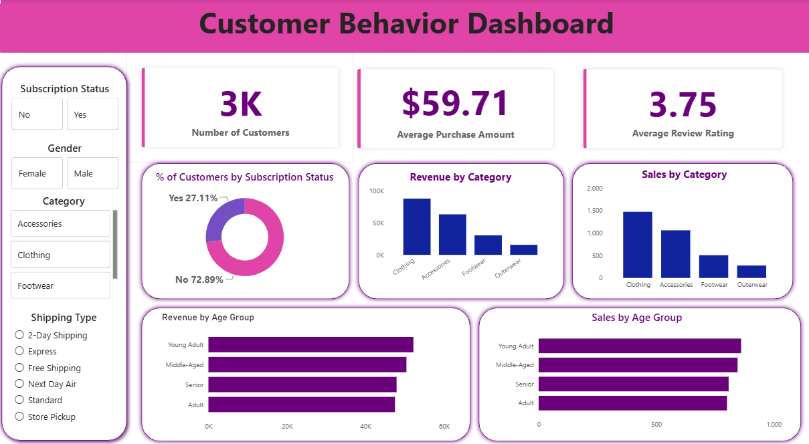

# 🛍️ Customer Shopping Behaviour Analysis

An end-to-end Data Analytics project that explores customer shopping behaviour using **Python, MySQL, and Power BI**. This project demonstrates the complete analytics workflow, including data cleaning, SQL-based analysis, and the development of an interactive dashboard to generate actionable business insights.

---

## 📌 Project Overview

Understanding customer purchasing behaviour is essential for improving business performance and customer satisfaction. This project analyses customer shopping data to uncover trends in purchasing habits, customer demographics, product performance, and subscription behaviour.

The analysis was carried out using Python for data preparation, MySQL for querying and exploration, and Power BI for interactive visualisation.

---

## 🛠️ Tools & Technologies

- **Python** (Pandas, NumPy)
- **Google Colab**
- **MySQL Workbench**
- **SQL**
- **Power BI Desktop**

---

## 📂 Repository Structure

```text
customer-behavior-analysis/
│
├── data/
│   └── raw/
│       ├── customer_shopping_behavior.csv
│       └── README.md
│
├── notebooks/
│   └── customer_behavior_data.ipynb
│
├── queries/
│   └── final/
│       └── customer_shopping_behavior.sql
│
├── reports/
│   ├── CustomerBehaviorDashboard.pbix
│   ├── Customer-Shopping-Behavior-Analysis-ppt.pptx
│   └── Dashboard.png
│
└── README.md
```

---

# 📊 Dashboard Preview



---

# 🎯 Business Questions

This project aims to answer the following business questions:

- Which product categories generate the highest revenue?
- Which customer segment contributes the most to sales?
- How does subscription status vary among customers?
- Which age groups spend the most?
- What is the average purchase amount?
- What is the average customer review rating?
- Which product categories have the highest number of purchases?

---

# 📈 Key Insights

- The dataset contains **3,000 customers**, providing a comprehensive view of customer shopping behavior.
- The **average purchase amount is $59.71**, indicating the typical spending per transaction.
- Customers gave an **average review rating of 3.75/5**, reflecting generally positive satisfaction levels.
- Approximately **73% of customers are non-subscribers**, while **27% are subscribed**, highlighting an opportunity to improve subscription adoption.
- **Clothing** is the highest-performing category in terms of both **revenue** and **sales volume**.
- **Accessories** is the second-largest contributor to overall revenue and customer purchases.
- **Young Adults** generate the highest revenue and sales, making them the most valuable customer segment.
- **Outerwear** contributes the lowest revenue and sales, indicating potential opportunities for targeted promotions or product improvements.

---

# 💡 Business Recommendations

Based on the analysis:

- Increase marketing efforts toward **Young Adult customers**, as they generate the highest revenue.
- Continue investing in the **Clothing** category, which consistently outperforms other categories.
- Launch subscription incentives or loyalty programs to convert non-subscribers into subscribers.
- Introduce targeted promotions for lower-performing categories such as **Outerwear**.
- Improve customer experience and product quality to increase the average review rating beyond **4.0**.

---

# ⚙️ Project Workflow

1. Imported the customer shopping dataset.
2. Cleaned and preprocessed the data using Python in Google Colab.
3. Imported the cleaned dataset into MySQL Workbench.
4. Performed SQL queries to answer business questions and identify trends.
5. Built an interactive dashboard in Power BI.
6. Presented findings through a project presentation and dashboard.

---

# 📁 Project Files

| File | Description |
|------|-------------|
| `customer_behavior_data.ipynb` | Data cleaning and preprocessing using Python |
| `customer_shopping_behavior.sql` | SQL queries used for analysis |
| `CustomerBehaviorDashboard.pbix` | Interactive Power BI dashboard |
| `Customer-Shopping-Behavior-Analysis-ppt.pptx` | Project presentation |
| `Dashboard.png` | Dashboard preview |
| `customer_shopping_behavior.csv` | Original dataset |

---

# 🚀 Skills Demonstrated

- Data Cleaning & Preprocessing
- Exploratory Data Analysis (EDA)
- SQL Query Writing
- Database Management (MySQL)
- Data Visualisation
- Dashboard Development
- Business Intelligence
- Data Storytelling

---

# 📚 Dataset

The project uses a customer shopping behaviour dataset containing information on:

- Customer demographics
- Product categories
- Purchase amount
- Review ratings
- Subscription status
- Shipping preferences
- Purchase frequency
- Seasonal purchases

---

# 🙌 Acknowledgements

This project was completed as part of my learning journey in Data Analytics to strengthen my skills in Python, SQL, MySQL, and Power BI by building a complete end-to-end analytics solution.

---

## 👩‍💻 Author

**Harshda Shirodkar**

If you found this project interesting, feel free to ⭐ the repository.
